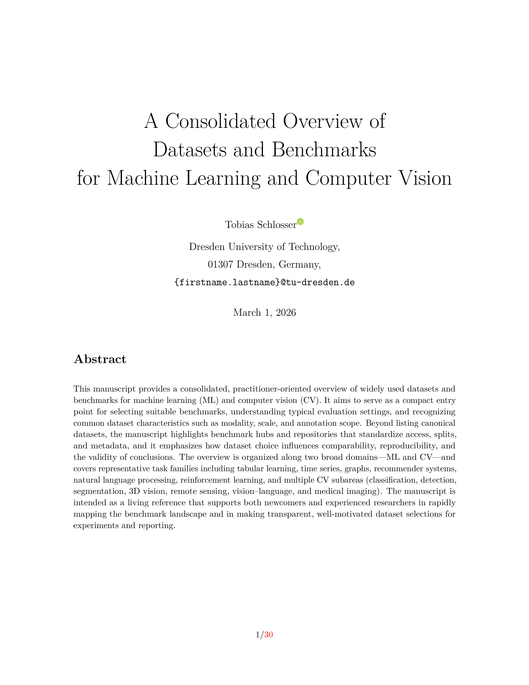

A Consolidated Overview of Datasets and Benchmarks for Machine Learning and Computer Vision
===========================================================================================


By Tobias Schlosser


---

This manuscript provides a consolidated, practitioner-oriented overview of widely used datasets and benchmarks for machine learning (ML) and computer vision (CV). It aims to serve as a compact entry point for selecting suitable benchmarks, understanding typical evaluation settings, and recognizing common dataset characteristics such as modality, scale, and annotation scope. Beyond listing canonical datasets, the manuscript highlights benchmark hubs and repositories that standardize access, splits, and metadata, and it emphasizes how dataset choice influences comparability, reproducibility, and the validity of conclusions. The overview is organized along two broad domains—ML and CV—and covers representative task families including tabular learning, time series, graphs, recommender systems, natural language processing, reinforcement learning, and multiple CV subareas (classification, detection, segmentation, 3D vision, remote sensing, vision–language, and medical imaging). The manuscript is intended as a living reference that supports both newcomers and experienced researchers in rapidly mapping the benchmark landscape and in making transparent, well-motivated dataset selections for experiments and reporting.

---


Please cite the paper in your publications if it helps your research:

```
@article{Schlosser2026_datasets,
  title={A Consolidated Overview of Datasets and Benchmarks for Machine Learning and Computer Vision},
  author={Schlosser, Tobias},
  year={2026}
}
```


Compilation
-----------

```
make clean && make
```


Example
-------



