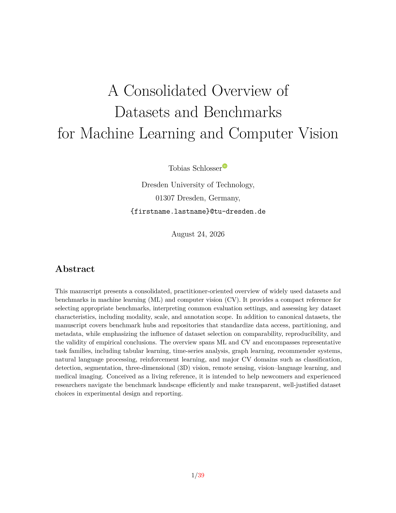

A Consolidated Overview of Datasets and Benchmarks for Machine Learning and Computer Vision
===========================================================================================


By Tobias Schlosser


---

This manuscript presents a consolidated, practitioner-oriented overview of widely used datasets and benchmarks in machine learning (ML) and computer vision (CV). It provides a compact reference for selecting appropriate benchmarks, interpreting common evaluation settings, and assessing key dataset characteristics, including modality, scale, and annotation scope. In addition to canonical datasets, the manuscript covers benchmark hubs and repositories that standardize data access, partitioning, and metadata, while emphasizing the influence of dataset selection on comparability, reproducibility, and the validity of empirical conclusions. The overview spans ML and CV and encompasses representative task families, including tabular learning, time-series analysis, graph learning, recommender systems, natural language processing, reinforcement learning, and major CV domains such as classification, detection, segmentation, three-dimensional (3D) vision, remote sensing, vision–language learning, and medical imaging. Conceived as a living reference, it is intended to help newcomers and experienced researchers navigate the benchmark landscape efficiently and make transparent, well-justified dataset choices in experimental design and reporting.

---


Please cite the paper in your publications if it helps your research:

```
@article{Schlosser2026_datasets,
  title={A Consolidated Overview of Datasets and Benchmarks for Machine Learning and Computer Vision},
  author={Schlosser, Tobias},
  year={2026}
}
```


Compilation
-----------

```
make clean && make
```


The manuscript
--------------



